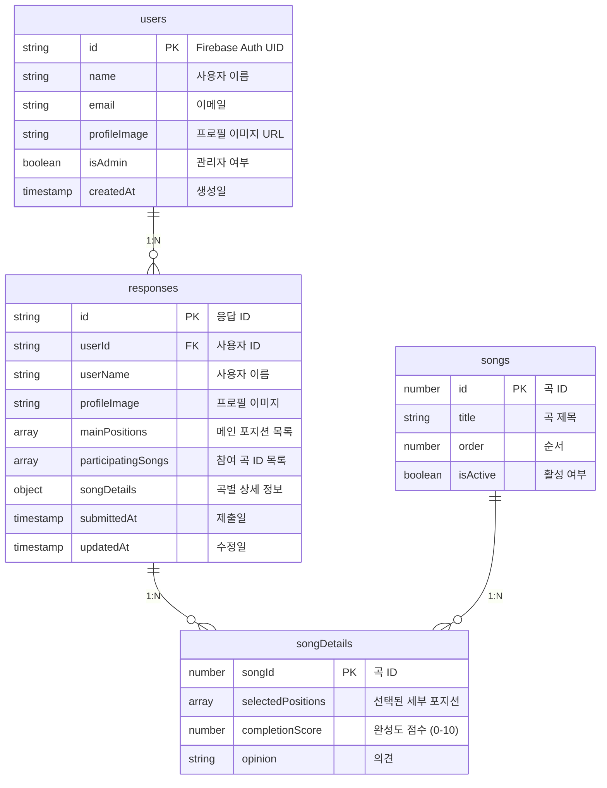

# 여운 공연 설문 조사 데이터베이스 스키마

## ERD (Entity Relationship Diagram)



## 컬렉션 상세 설명

### 1. Users 컬렉션

- **목적**: 사용자 정보 저장
- **키**: Firebase Auth UID
- **관계**: 1명의 사용자가 N개의 응답을 가질 수 있음

### 2. Responses 컬렉션

- **목적**: 설문 응답 데이터 저장
- **키**: 자동 생성된 문서 ID
- **특징**: 사용자당 1개의 응답만 허용

### 3. Songs 컬렉션

- **목적**: 곡 정보 저장 (선택사항)
- **키**: 곡 ID (1-18)
- **용도**: 곡 목록 관리

## 데이터 타입 정의

### MainPosition

```typescript
type MainPosition = "보컬" | "코러스" | "기타" | "베이스" | "드럼" | "키보드";
```

### DetailedPosition

```typescript
type DetailedPosition =
  | "보컬"
  | "코러스"
  | "기타 어쿠스틱"
  | "기타 리드"
  | "기타 백킹"
  | "베이스"
  | "드럼"
  | "메인 키보드"
  | "세컨 키보드";
```

### SongDetail

```typescript
interface SongDetail {
  selectedPositions: DetailedPosition[];
  completionScore: number | null; // 0-10
  opinion: string;
}
```

## 보안 규칙

```javascript
rules_version = '2';
service cloud.firestore {
  match /databases/{database}/documents {
    // 사용자는 자신의 정보만 읽기/쓰기
    match /users/{userId} {
      allow read, write: if request.auth != null && request.auth.uid == userId;
    }

    // 응답은 인증된 사용자만 생성 가능
    match /responses/{responseId} {
      allow create: if request.auth != null;
      allow read: if request.auth != null &&
        (request.auth.uid == resource.data.userId ||
         get(/databases/$(database)/documents/users/$(request.auth.uid)).data.isAdmin == true);
    }

    // 곡 정보는 모든 인증된 사용자가 읽기 가능
    match /songs/{songId} {
      allow read: if request.auth != null;
      allow write: if request.auth != null &&
        get(/databases/$(database)/documents/users/$(request.auth.uid)).data.isAdmin == true;
    }
  }
}
```

## 인덱스 설정

### 권장 인덱스

1. **responses 컬렉션**:

   - `userId` (단일 필드)
   - `submittedAt` (단일 필드)
   - `participatingSongs` (배열)

2. **users 컬렉션**:
   - `isAdmin` (단일 필드)
   - `createdAt` (단일 필드)

## 데이터 백업 전략

1. **자동 백업**: Firebase 자동 백업 활성화
2. **수동 백업**: 주요 업데이트 전 수동 백업
3. **데이터 내보내기**: 필요시 CSV/JSON 형태로 내보내기
